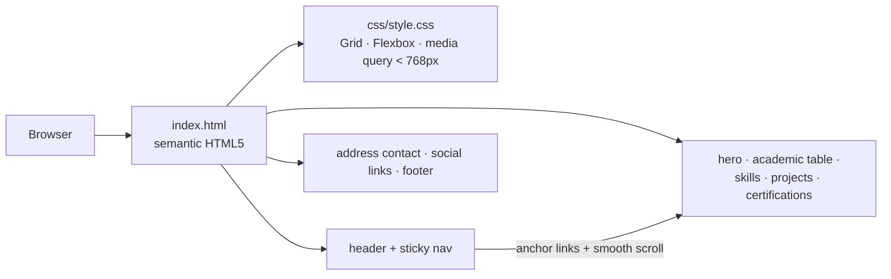
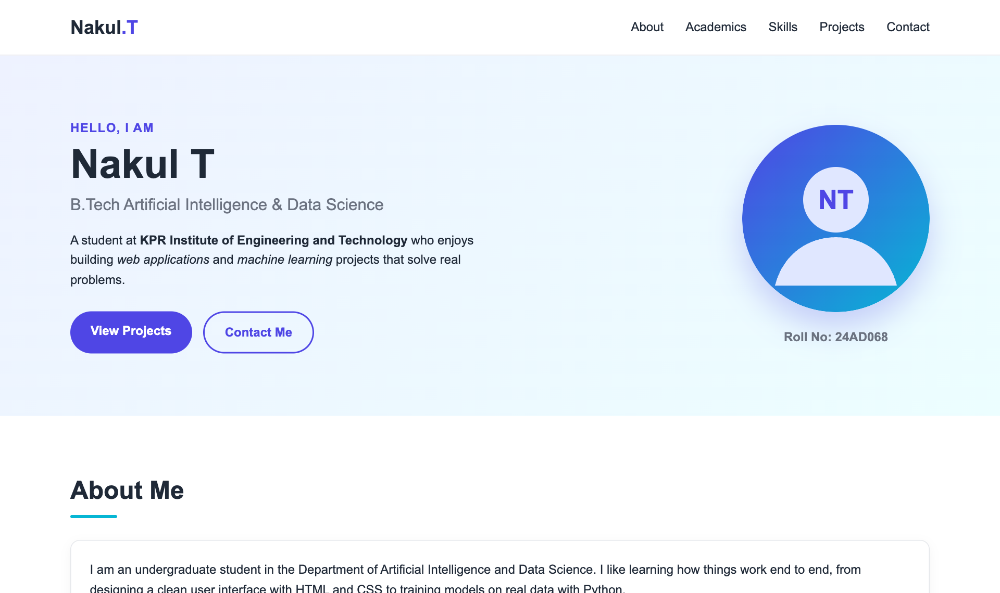
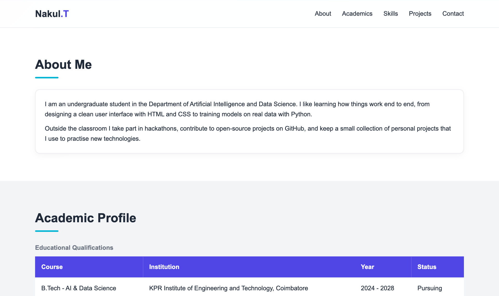
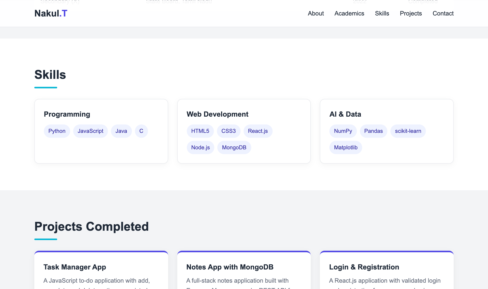
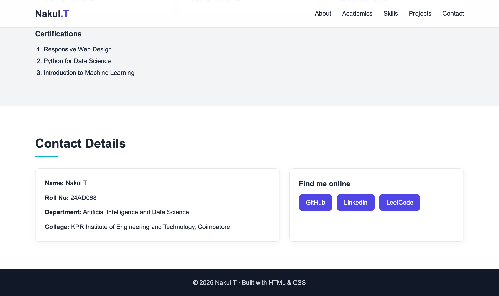

# Personal Profile Website using HTML and CSS

> **Application Development Laboratory (U21AD502) — Experiment 01**
> Prepared by **Nakul T (24AD068)**, Department of Artificial Intelligence and Data Science, KPR Institute of Engineering and Technology.

## Project Overview

A responsive, single-page personal profile website built only with semantic HTML5 and CSS3. It presents an introduction, academic profile, skills, completed projects, certifications, contact details and social media links, with a sticky navigation bar that scrolls smoothly to each section.

**Aim:** To develop a personal profile website using HTML and CSS in such a way that it includes basic contact details, academic profile, projects completed, links to social media pages, etc.

## Features

- Sticky header with navigation links that smooth-scroll to each section
- Hero section with name, programme, short bio, call-to-action buttons and profile picture
- Academic profile presented in an HTML table with caption, header and body
- Skills shown as tag lists inside cards arranged with CSS Grid
- Project cards with hover animation and links to GitHub repositories
- Ordered list of certifications, contact details inside an address block and social media buttons
- Responsive layout using a media query for screens narrower than 768px
- Uses all primary HTML tags: header, nav, main, section, article, figure, table, ul, ol, address, footer, img, a, strong, em

## Tech Stack

| Layer | Technology |
|---|---|
| Markup | HTML5 (semantic elements) |
| Styling | CSS3 (Flexbox, Grid, custom properties, media queries) |
| Assets | SVG profile avatar |
| Tools | VS Code, Google Chrome |

## Architecture



It is a static, client-only page with no JavaScript. Navigation uses in-page anchors with `scroll-behavior: smooth`, and the layout adapts through one media query.

## Folder Structure

```
exp01-personal-profile-website/
├── .gitignore
├── LICENSE
├── README.md
├── css/
│   └── style.css
├── images/
│   └── avatar.svg
├── index.html
└── screenshots/   (output screenshots)
```

## Setup and Installation

1. Clone the repository: `git clone https://github.com/nakultt/exp01-personal-profile-website.git`
2. Open the folder: `cd exp01-personal-profile-website`
3. No build step or dependencies are required.

## How to Run

Open `index.html` directly in any modern browser, **or** serve it locally:

```bash
npx serve .
```

Then visit the URL printed in the terminal.

## Screenshots

### 1. Home page – header, navigation and hero section



### 2. About Me and Academic Profile sections



### 3. Skills and Projects Completed sections



### 4. Certifications, contact details, social media links and footer



## Result

The project was successfully developed and executed, and the output was verified.

## Author

**Nakul T** — 24AD068 · B.Tech Artificial Intelligence and Data Science · [github.com/nakultt](https://github.com/nakultt)
